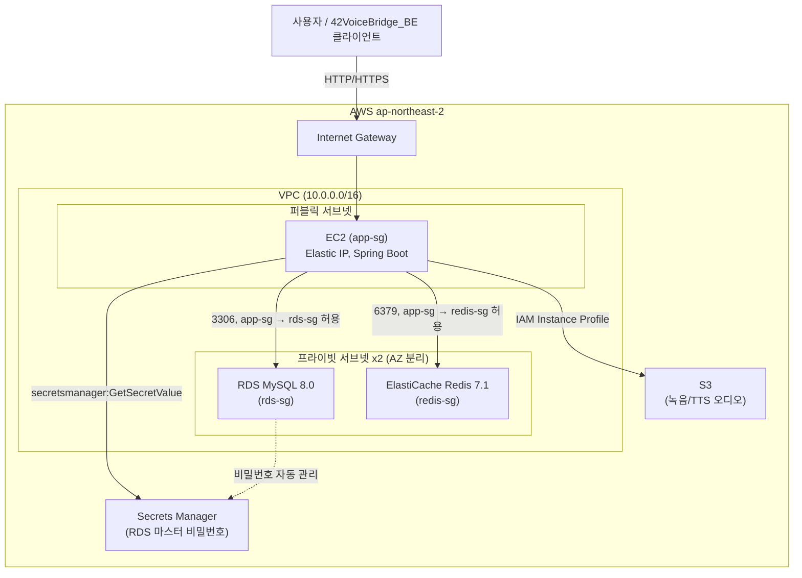

# 42VoiceBridge_Infra

[42VoiceBridge_BE](https://github.com/42VoiceBridge/42VoiceBridge_BE) 백엔드가 올라가는 AWS 인프라를 Terraform으로 관리하는 저장소입니다. EC2(앱) + RDS MySQL + ElastiCache Redis + S3(녹음/TTS 오디오)로 구성되어 있으며, AI 서버와 네이버 클로바 보이스는 이 인프라 범위 밖의 외부 서비스입니다.

> ⚠️ 상시 가동하지 않고 테스트할 때만 `apply` → 끝나면 즉시 `destroy` 합니다. 자세한 비용/실행 순서는 [`docs/GUIDE.md`](docs/GUIDE.md) 참고.

## 기술 스택

| 구분 | 기술 |
|---|---|
| IaC | Terraform, 계층형 3-layer 구조 (`1_base` → `2_storage` → `3_application`) |
| State | Terraform local backend — 레이어마다 독립된 `terraform.tfstate`, 상위 레이어는 `terraform_remote_state`로 하위 값을 참조 |
| Cloud | AWS ap-northeast-2 (서울 리전) |
| Compute | EC2 (Amazon Linux 2023) + Elastic IP |
| Database | RDS MySQL 8.0 — 마스터 비밀번호는 AWS Secrets Manager가 자동 관리 |
| Cache | ElastiCache Redis 7.1 |
| Storage | S3 — 녹음/TTS 오디오 저장, 퍼블릭 액세스 완전 차단 |
| Network | VPC — 퍼블릭 서브넷 1개(앱) + 프라이빗 서브넷 2개(RDS/Redis), NAT 게이트웨이 없음 |
| IAM | EC2 Instance Profile — S3 읽기/쓰기 + Secrets Manager 읽기만 최소 권한으로 부여 |

## 아키텍처

- **app-sg**: SSH(본인 IP만) + HTTP/HTTPS만 인바운드 허용.
- **rds-sg / redis-sg**: app-sg에서 오는 트래픽만 각각 3306/6379로 허용 — 인터넷에서 직접 접근 불가.
- 프라이빗 서브넷에는 NAT 게이트웨이를 두지 않았습니다 (RDS/Redis는 아웃바운드 인터넷이 필요 없고, 비용도 절감).
- S3는 VPC 밖의 리소스지만 EC2의 IAM Instance Profile을 통해서만 접근합니다.

## 레이어 구조

단일 파일 대신 `1_base`(VPC/서브넷/보안그룹) → `2_storage`(RDS/Redis/S3) → `3_application`(EC2/IAM) 3개 레이어로 나눠 관리합니다. 의존 방향, 실행/destroy 순서, 레이어별 output 조회 방법 등 실제로 손 움직이기 전에 필요한 내용은 전부 [`docs/GUIDE.md`](docs/GUIDE.md)에 있습니다.

## 운영

| 역할 | 담당 |
|---|---|
| 인프라 설계, 운영 | 김주영 |

## 더 알아보기

- 인프라 구조, 비용 경고, 실행/destroy 순서, 연결 정보 조회, `.env` 작성법: [`docs/GUIDE.md`](docs/GUIDE.md)
- 애플리케이션이 필요로 하는 환경변수 전체 목록: [42VoiceBridge_BE의 `docs/DEPLOYMENT.md`](https://github.com/42VoiceBridge/42VoiceBridge_BE/blob/develop/docs/DEPLOYMENT.md)
