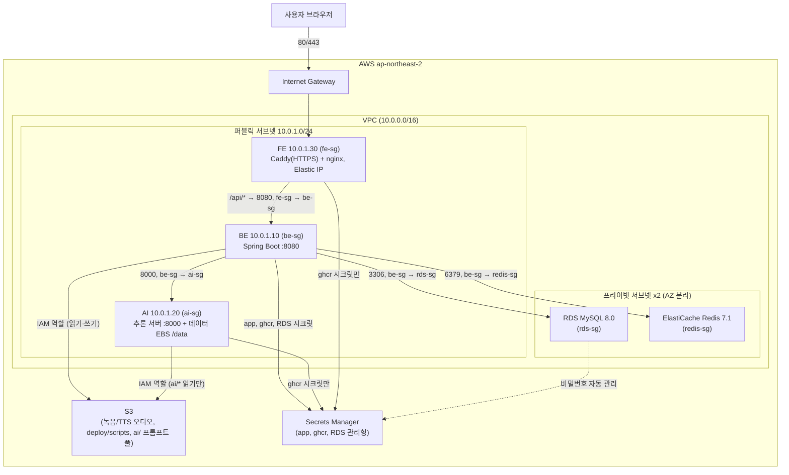
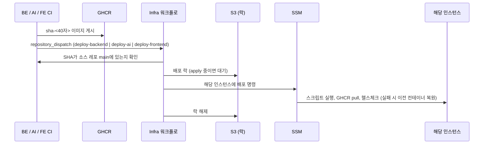

# 42VoiceBridge_Infra

[FE](https://github.com/42VoiceBridge/42VoiceBridge_FE)·[BE](https://github.com/42VoiceBridge/42VoiceBridge_BE)·[AI](https://github.com/42VoiceBridge/42VoiceBridge_AI)가 올라가는 AWS 인프라를 Terraform으로 관리하는 저장소입니다. **FE·BE·AI 개별 EC2 3대** + RDS MySQL + ElastiCache Redis + S3(녹음/TTS 오디오)로 구성되며([ADR 0006](docs/adr/0006-three-instance-topology.md)), 네이버 클로바 보이스는 이 인프라 범위 밖의 외부 서비스입니다. 각 레포의 CI가 이미지를 게시한 뒤 이 저장소의 워크플로를 호출해 해당 인스턴스의 이미지만 교체합니다.

> 2026-10-03 기준 **코드와 오프라인 테스트까지 구현**했고 **AWS에는 적용하지 않았습니다.** 확인된 것과 아닌 것은 [인프라 검증 가이드](docs/INFRA-VERIFICATION.md)에 있습니다.

> ⚠️ 상시 가동하지 않고 테스트할 때만 `apply` → 끝나면 즉시 `destroy` 합니다. 자세한 비용/실행 순서는 [`docs/GUIDE.md`](docs/GUIDE.md) 참고.

## 기술 스택

| 구분 | 기술 |
|---|---|
| IaC | Terraform, 계층형 3-layer 구조 (`1_base` → `2_storage` → `3_application`) |
| State | `42voicebridge-tfstate` S3 backend — 레이어별 별도 경로와 S3 잠금 파일 사용, 상위 레이어는 `terraform_remote_state`로 하위 값을 참조 |
| Cloud | AWS ap-northeast-2 (서울 리전) |
| Compute | EC2 3대(Amazon Linux 2023): FE(+Caddy 엣지, Elastic IP), BE, AI(+전용 데이터 EBS). 사양은 모두 **초기 시험 사양**(실측 후 확정) |
| Database | RDS MySQL 8.0 — 마스터 비밀번호는 AWS Secrets Manager가 자동 관리 |
| Cache | ElastiCache Redis 7.1 |
| Storage | S3 — 녹음/TTS 오디오 저장, 퍼블릭 액세스 완전 차단 |
| Network | VPC — 퍼블릭 서브넷 1개(FE·BE·AI, 고정 사설 IP) + 프라이빗 서브넷 2개(RDS/Redis), NAT 게이트웨이 없음 |
| IAM | 인스턴스별 역할 3개(최소 권한): 공통 SSM·배포 스크립트·GHCR 시크릿, BE만 앱·RDS 시크릿과 버킷 쓰기, AI는 `ai/*` 읽기만 |
| 백업 | AI 데이터 EBS(암호화, `prevent_destroy`) + DLM 일일 스냅샷 7개 보존 |

## 아키텍처

- **fe-sg**: 인터넷에 80/443만 공개(80은 Let's Encrypt 검증과 리다이렉트). SSH 없음.
- **be-sg**: **fe-sg에서 온 8080만** 허용 + 제한된 CIDR의 SSH. BE는 인터넷에 직접 공개하지 않는다.
- **ai-sg**: **be-sg에서 온 8000만** 허용(AI는 인증이 없어 이 규칙이 유일한 접근 통제). SSH 없음.
- **rds-sg / redis-sg**: be-sg에서 오는 트래픽만 각각 3306/6379로 허용 — 인터넷에서 직접 접근 불가.
- 프라이빗 서브넷에는 NAT 게이트웨이를 두지 않았습니다. 그래서 GHCR pull, 모델 다운로드, SSM이 필요한 세 인스턴스는 모두 퍼블릭 서브넷에 둡니다.
- 도메인이 없으면 FE의 Elastic IP 공개 DNS 이름으로 HTTPS를 발급받습니다. 자세한 내용과 한계는 [네트워크·엣지 가이드](docs/NETWORK-AND-EDGE.md).

## CI/CD 파이프라인

BE·AI·FE 각 저장소의 CI가 이미지를 GHCR에 게시한 뒤 Infra로 이벤트를 보내면, 해당 컴포넌트의 인스턴스만 SSM으로 교체합니다. 상세는 [CI/CD 흐름](docs/CICD-FLOW.md).

- 호출용 토큰 `INFRA_DISPATCH_TOKEN`은 **각 소스 저장소의 Secret**(Variable 금지)에 두고, 배포용 AWS 키는 **Infra 저장소 Secrets**에 둡니다. 호출 방식과 키 권한은 [후속 작업](docs/FOLLOW-UPS.md).
- 이미지 경로는 이벤트 payload가 아니라 Infra 저장소 Variables(`BE_IMAGE_REPOSITORY`, `AI_IMAGE_REPOSITORY`, `FE_IMAGE_REPOSITORY`)와 SHA로만 조립합니다. 이벤트 형식 검증과 소스 레포 `main` 포함 확인을 거칩니다.
- Terraform apply와 배포가 겹치지 않도록 S3 락을 씁니다. 인스턴스가 교체되면 마지막 성공 배포로 자동 복원합니다.
- **초기 프로비저닝은 레이어별로 순서대로** 진행합니다: `Terraform plan (one layer)` → 검토 → `Terraform apply (one layer, saved plan)`을 `1_base → 2_storage → 3_application` 순서로. 하위 레이어 state가 없는 첫 배포에서는 한 번에 전체 plan이 불가능하고, 검토한 저장된 plan만 적용되며 삭제·교체는 `allow_destroy`를 요구합니다. 잠금은 끄지 않습니다.
- [`cd-preflight.yml`](.github/workflows/cd-preflight.yml)은 수동으로 AWS 접근과 Terraform 구성을 점검합니다(배포하지 않음). [`ssm-deploy.yml`](.github/workflows/ssm-deploy.yml)(수동)은 `check`/`measure`/`deploy`/`redeploy`를 제공합니다. [`infra-tests.yml`](.github/workflows/infra-tests.yml)은 AWS 없이 shellcheck, 스크립트·워크플로 테스트, Terraform validate·mock 테스트를 PR마다 실행합니다. [SSM 배포 절차](docs/SSM-DEPLOYMENT.md)
- 테스트 후 인프라 종료는 `3_application → 2_storage → 1_base` 순서입니다. AI 데이터 볼륨의 `prevent_destroy` 때문에 단순 destroy가 중단되므로 [데이터 보호 가이드](docs/DATA-PROTECTION.md)를 따릅니다.

## 레이어 구조

단일 파일 대신 `1_base`(VPC/서브넷/보안그룹 5개) → `2_storage`(RDS/Redis/S3) → `3_application`(EC2 3대/EIP/IAM 역할 3개/AI 데이터 볼륨) 3개 레이어로 나눠 관리합니다. 의존 방향, 실행/destroy 순서, 레이어별 output 조회 방법 등 실제로 손 움직이기 전에 필요한 내용은 전부 [`docs/GUIDE.md`](docs/GUIDE.md)에 있습니다.

## 운영

| 역할 | 담당 |
|---|---|
| 인프라 설계, 운영 | 김주영 |

## 더 알아보기

- 현재 배포 진행 상황과 다음 작업: [`deploy-step.md`](deploy-step.md)
- **다른 인프라 담당자가 확인할 때(검증 상태, 코드 리뷰 포인트, plan 검토, apply 후 확인 명령)**: [`docs/INFRA-VERIFICATION.md`](docs/INFRA-VERIFICATION.md)
- 네트워크(주소·포트·보안그룹), FE HTTPS 엣지, 도메인 없는 운영: [`docs/NETWORK-AND-EDGE.md`](docs/NETWORK-AND-EDGE.md)
- 이벤트 배포, 락, 레이어별 plan/apply, 저장소 설정: [`docs/CICD-FLOW.md`](docs/CICD-FLOW.md)
- AI 인스턴스 배포, 데이터 볼륨, 프롬프트 풀, 배포 체크리스트: [`docs/AI-DEPLOYMENT.md`](docs/AI-DEPLOYMENT.md)
- AI 데이터 백업·삭제·복원 절차: [`docs/DATA-PROTECTION.md`](docs/DATA-PROTECTION.md)
- 사양·비용 추정치와 확정 절차: [`docs/OPERATIONS-SIZING.md`](docs/OPERATIONS-SIZING.md)
- **후속 작업(호출 방식, AWS 키, 도메인 등)**: [`docs/FOLLOW-UPS.md`](docs/FOLLOW-UPS.md)
- AI를 제외한 BE 선배포 범위와 실행 순서: [`docs/BE-ONLY-DEPLOYMENT.md`](docs/BE-ONLY-DEPLOYMENT.md)
- AWS 계정·IAM 역할·Secrets Manager 개념과 앱 시크릿 등록: [`docs/concepts/README.md`](docs/concepts/README.md)
- 인프라 구조, 비용 경고, 실행/destroy 순서, 연결 정보 조회, `.env` 작성법: [`docs/GUIDE.md`](docs/GUIDE.md)
- CD용 AWS 수동 설정 현황과 남은 작업: [`docs/DEPLOYMENT-SETUP.md`](docs/DEPLOYMENT-SETUP.md)
- 트러블슈팅 기록: [`docs/troubleshooting/README.md`](docs/troubleshooting/README.md)
- 환경변수·토큰의 관리 주체, 저장 위치, 읽기 권한: [`docs/ENVIRONMENT-VARIABLES.md`](docs/ENVIRONMENT-VARIABLES.md)
- 배포 관련 설계 결정: [`docs/adr/README.md`](docs/adr/README.md)
- 애플리케이션이 필요로 하는 환경변수 전체 목록: [42VoiceBridge_BE의 `docs/DEPLOYMENT.md`](https://github.com/42VoiceBridge/42VoiceBridge_BE/blob/develop/docs/DEPLOYMENT.md)
