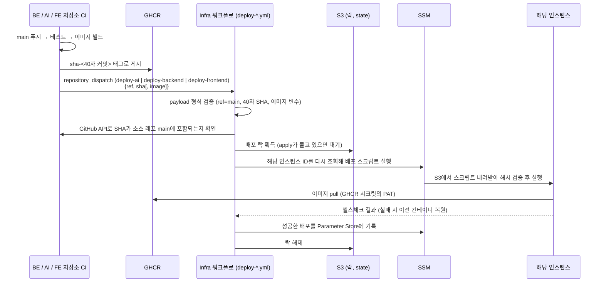

# CI/CD 흐름: 이벤트 배포, 락, 레이어별 apply

2026-10-03 기준 코드와 오프라인 테스트까지 구현했다. **AWS에 적용하지 않았고 실제 이벤트로 실행해 본 적이 없다.** 결정은 [ADR 0006](adr/0006-three-instance-topology.md), 네트워크는 [네트워크·엣지 가이드](NETWORK-AND-EDGE.md).

## 전체 흐름

## 레포별 이벤트

| 이벤트 | 보내는 쪽 | Infra 워크플로 | 소스 레포(출처 검증) | 이미지 변수 | 배포 대상 |
|---|---|---|---|---|---|
| `deploy-ai` | AI CI(구현됨) | [`deploy-ai.yml`](../.github/workflows/deploy-ai.yml) | `42VoiceBridge/42VoiceBridge_AI` | `AI_IMAGE_REPOSITORY` | AI 인스턴스 |
| `deploy-backend` | BE CI(**미구현**) | [`deploy-backend.yml`](../.github/workflows/deploy-backend.yml) | `42VoiceBridge/42VoiceBridge_BE` | `BE_IMAGE_REPOSITORY` | BE 인스턴스 |
| `deploy-frontend` | FE CI(구현됨) | [`deploy-frontend.yml`](../.github/workflows/deploy-frontend.yml) | `42VoiceBridge/42VoiceBridge_FE` | `FE_IMAGE_REPOSITORY` | FE 인스턴스 |

- payload: `{"event_type": "...", "client_payload": {"ref": "refs/heads/main", "sha": "<40자 소문자>", "image": "<선택>"}}`. `image`는 있어도 **배포에 쓰지 않는다.** Infra의 `*_IMAGE_REPOSITORY` 변수와 SHA로 조립한 값과 같은지만 비교하고 다르면 중단한다.
- 세 워크플로는 [`deploy-component.yml`](../.github/workflows/deploy-component.yml)(재사용)을 호출하는 얇은 파일이다. 같은 컴포넌트의 이벤트는 직렬화하고(`concurrency: deploy-<컴포넌트>`), 다른 컴포넌트는 병렬로 돈다.
- `repository_dispatch`는 **기본 브랜치(`main`)의 워크플로만** 실행한다. 이 워크플로들이 `main`에 머지되기 전에는 이벤트가 와도 아무것도 실행되지 않는다(API는 204를 반환한다). 보내는 쪽 CI가 성공으로 끝나도 배포가 되지 않은 것이므로 주의한다.
- BE의 `deploy-backend`는 예전에 `cd-preflight`가 받아 점검만 했다. 이제 `deploy-backend.yml`이 받아 **실제로 배포한다.** BE CI가 이 이벤트를 보내도록 추가하는 것은 BE 레포의 작업이다.

### 입력 검증과 출처 검증 (보안)

- **형식 검증**([`validate-dispatch.sh`](../scripts/ci/validate-dispatch.sh)): `ref == refs/heads/main`, 40자 소문자 SHA, 이미지 변수가 `ghcr.io/42voicebridge/<패키지>` 형식. 이것은 **형식 검사일 뿐 "main CI를 통과한 이미지"의 증명이 아니다.** 토큰을 가진 호출자는 값을 마음대로 적을 수 있다.
- **출처 검증**([`verify-source-commit.sh`](../scripts/ci/verify-source-commit.sh)): GitHub API(`compare/main...<sha>`)로 그 SHA가 소스 레포 `main`에 포함되는지(`identical` 또는 `behind`) 확인한다. `ahead`·`diverged`·조회 실패는 모두 배포하지 않는다(fail closed). 이것으로 "main에 올라가지 않은 커밋"의 배포는 막지만, 같은 커밋의 이미지 태그가 덮어쓰기 되는 경우까지 막지는 못한다. 그 보완(다이제스트 고정)은 [후속 작업](FOLLOW-UPS.md)이다.
- 이미지는 항상 `*_IMAGE_REPOSITORY`(Infra 변수) + `:sha-<SHA>`로 조립한다. 배포 스크립트도 EC2에서 `ghcr.io/42voicebridge/<패키지>:sha-<40자>` 형식만 실행한다.
- 워크플로 스크립트에는 `${{ }}`를 직접 넣지 않고 환경변수로만 전달한다(명령 삽입 방지). 이 규칙을 [`workflows.test.sh`](../scripts/ci/test/workflows.test.sh)가 모든 워크플로에 대해 검사한다.
- 토큰(`INFRA_DISPATCH_TOKEN`)은 **Secret**이어야 한다. Variable은 평문이라 노출 위험이 있다. 호출 방식과 토큰 권한은 [후속 작업](FOLLOW-UPS.md).

## apply와 배포가 겹치지 않게 하는 락

Terraform apply가 인스턴스를 교체하는 동안 SSM 배포가 실행되면 이전 인스턴스를 대상으로 삼는 충돌이 생긴다. GitHub `concurrency`만으로는 부족하다. 같은 그룹은 **실행 1개 + 대기 1개만** 유지하고 그 사이에 온 대기 건은 취소되기 때문에, BE/AI/FE 배포가 apply와 겹쳐 쌓이면 일부 배포가 조용히 사라질 수 있다.

그래서 S3 조건부 쓰기(`put-object --if-none-match '*'`)로 만든 락을 쓴다([`infra-lock.sh`](../scripts/ci/infra-lock.sh)). 위치는 state 버킷의 `locks/dev/`다.

| 락 | 누가 잡나 | 의미 |
|---|---|---|
| `locks/dev/deploy-<컴포넌트>` | 서비스 배포(수동 배포는 `deploy-manual`) | 같은 컴포넌트는 직렬화, 다른 컴포넌트는 병렬 |
| `locks/dev/apply` | Terraform apply | 진행 중인 배포가 모두 끝나야 진행, 그동안 새 배포는 대기 |

- 서로 **자기 락을 먼저 만든 뒤** 상대 락을 확인한다. 배포는 apply 락이 보이면 자기 락을 지우고 양보하고, apply는 배포 락이 모두 사라질 때까지 기다린다. 동시에 시작해도 한쪽(배포)이 반드시 양보하므로 교착이 없다.
- 기본 대기 시간은 40분이고, 비정상 종료로 남은 락은 2시간이 지나면 정리한다.
- 배포는 SSM으로 보내기 직전에 인스턴스 ID를 **다시 조회**한다(오래된 ID를 쓰지 않는다).
- 한계: 락은 이 워크플로들 사이의 약속이다. 락을 거치지 않고 사람이 직접 `terraform apply`하거나 SSM 명령을 보내면 막지 못한다.

### apply 후 복원

성공한 배포는 SSM Parameter Store(`/voicebridge/dev/deployed/<컴포넌트>`)에 이미지로 기록된다. apply가 인스턴스를 교체하면 새 인스턴스는 빈 상태이므로, `3_application` apply 직후 [`post-apply.sh`](../scripts/ci/post-apply.sh)가 인스턴스가 준비될 때까지(`check` 통과) 기다린 뒤 `run.sh redeploy`로 마지막 성공 배포를 다시 올린다. 기록이 없는 컴포넌트(첫 apply)는 건너뛴다. 기록 권한이 없으면 배포는 성공하되 경고가 나온다.

## 초기 인프라 프로비저닝: 레이어별로 순서대로

하위 레이어 state가 없는 첫 배포에서는 한 번에 전체를 plan/apply할 수 없다. `2_storage`는 `1_base`의 state를, `3_application`은 앞 두 레이어의 state를 읽기 때문이다(하위 state가 없으면 `Error: Unable to find remote state`로 plan이 실패하는 것을 재현해 확인했다). 그래서 워크플로도 레이어 하나씩 다룬다.

| 단계 | 워크플로 | 입력 | 확인 |
|---|---|---|---|
| 1 | **Terraform plan (one layer)** | `layer=1_base` | 실행 요약과 `tfplan-1_base` 아티팩트를 검토 |
| 2 | **Terraform apply (one layer, saved plan)** | `layer=1_base`, `plan_run_id=<1의 실행 ID>` | 적용 로그 |
| 3~4 | 위와 같음 | `layer=2_storage` | |
| 5~6 | 위와 같음 | `layer=3_application` | apply 직후 `check`와 `redeploy`가 자동 실행됨 |

- **순서 강제:** 하위 레이어가 apply되기 전에는 상위 레이어의 plan·apply를 거부한다([`tf-layer.sh`](../scripts/ci/tf-layer.sh)가 하위 레이어의 state 객체를 확인).
- **검토한 plan만 적용:** apply는 plan 실행의 아티팩트(`tfplan`)를 그대로 쓴다. 다시 계산하지 않으므로 검토한 내용만 적용되고, 그 사이 state가 바뀌었다면 Terraform이 "stale plan"으로 거부한다. 추가로 plan과 **같은 커밋**인지, plan 파일의 **체크섬**이 맞는지 확인한다. plan은 `main`에서 만든 것이어야 한다(apply가 `main`에서만 실행되고 커밋이 일치해야 하므로).
- **파괴·교체 방지:** plan에 삭제·교체가 있으면 plan 요약에 대상이 나열되고, apply는 `allow_destroy=true`를 명시하지 않으면 거부한다. 인스턴스 교체(예: AMI 변경)도 여기에 걸린다.
- **잠금 유지:** Terraform 잠금(S3 `.tflock`)을 끄지 않는다(`-lock=false` 금지). 잠금이 잡혀 있으면 5분까지 기다린다.
- **승인 게이트는 두지 않았다.** PR 승인과 수동 실행이 사람의 확인 절차다. 이 워크플로들은 수동 실행 전용이고 자동으로 실행되지 않는다.
- plan에 필요한 입력 변수(기본값이 없는 것)는 Infra 저장소 Variables에서 받는다: `1_base`는 `SSH_ALLOWED_CIDR`(**`0.0.0.0/0` 거부**), `3_application`은 `SSH_KEY_NAME`.

## Infra 저장소에 필요한 설정

| 종류 | 이름 | 용도 |
|---|---|---|
| Variable | `BE_IMAGE_REPOSITORY`, `AI_IMAGE_REPOSITORY`, `FE_IMAGE_REPOSITORY` | 이미지 경로(`ghcr.io/42voicebridge/<패키지>`). AI·BE 패키지명은 각 레포 CI 기준 `42voicebridge_ai`, `42voicebridge_be`. 자리 표시자(`<실제-…>`)가 남아 있으면 배포가 형식 검증에서 중단된다 |
| Variable | `SSH_ALLOWED_CIDR`, `SSH_KEY_NAME` | plan 입력(`1_base`, `3_application`) |
| Secret | `AWS_ACCESS_KEY_ID`, `AWS_SECRET_ACCESS_KEY` | 배포용 IAM 사용자 키. 필요한 권한은 [후속 작업](FOLLOW-UPS.md) |

각 소스 레포(BE·AI·FE)에는 `INFRA_DISPATCH_TOKEN`(**Secret**)이 필요하다.

## 수동 점검·배포

[`ssm-deploy.yml`](../.github/workflows/ssm-deploy.yml)(수동)은 다음을 지원한다.

| mode | 동작 |
|---|---|
| `check` | 세 인스턴스의 SSM 연결, Docker, AI의 `/data` 마운트 확인 |
| `measure` | 세 인스턴스의 메모리·CPU·디스크·컨테이너 사용량을 읽기 전용으로 수집([사양 확정 절차](OPERATIONS-SIZING.md)) |
| `deploy` | `be_sha`, `ai_sha`, `fe_sha` 중 지정한 컴포넌트만 배포. 순서는 AI → BE → FE이고 앞이 실패하면 멈춘다 |
| `redeploy` | 마지막 성공 배포를 다시 배포(인스턴스 교체 후) |

## 문제가 생겼을 때

| 증상 | 원인 후보 |
|---|---|
| 이벤트를 보냈는데 Actions에 실행이 없다 | 워크플로가 아직 `main`에 없다 / 이벤트 타입 오타 |
| 형식 검증 실패 `Repository variable ... must be ghcr.io/42voicebridge/<package>` | `*_IMAGE_REPOSITORY` 변수가 비었거나 자리 표시자 |
| `is not on <repo>@main` | 그 SHA가 소스 레포 `main`에 없다(브랜치 커밋, 다른 가지) |
| `Timed out waiting for ... lock` | apply나 같은 컴포넌트의 이전 배포가 오래 걸린다. `locks/dev/`의 객체를 확인(2시간 지나면 자동 정리) |
| `Layer X has no state yet` | 하위 레이어를 먼저 apply해야 한다 |
| `plan destroys or replaces N resources` | 목록을 검토하고 의도한 것이면 `allow_destroy=true` |
| `does not match ... image repository` | payload의 `image`가 Infra 변수와 SHA로 조립한 값과 다르다(변수 또는 송신측 설정 불일치) |
| pull 인증 실패 | GHCR 시크릿(`voicebridge/dev/ghcr`)의 PAT 종류·권한 확인([AI 배포 가이드](AI-DEPLOYMENT.md)) |
