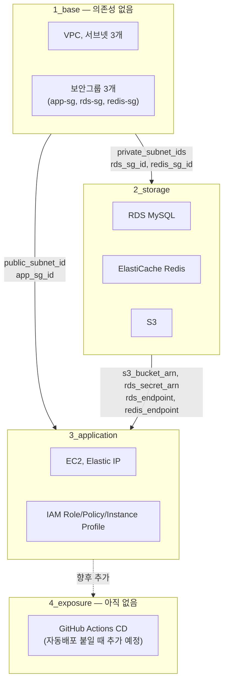

# 42VoiceBridge AWS Infra (Terraform)

EC2(앱) + RDS MySQL + ElastiCache Redis + S3(녹음/TTS 오디오)로 구성된
42VoiceBridge 백엔드 인프라입니다. AI 서버와 네이버 클로바 보이스는 이 인프라
범위 밖의 외부 서비스입니다.

> 실제 애플리케이션이 필요로 하는 환경변수 전체 목록과 "이 값을 어디서
> 가져오는지"는 [42VoiceBridge_BE의 `docs/DEPLOYMENT.md`](https://github.com/42VoiceBridge/42VoiceBridge_BE/blob/develop/docs/DEPLOYMENT.md)를 참고하세요.

> CD용 AWS 콘솔 설정과 배포 결정은 [CD 준비 상태](DEPLOYMENT-SETUP.md) 및 [ADR 목록](adr/README.md)에 기록합니다. 아래 Terraform 명령은 현재 코드의 **S3 state 방식** 기준입니다.

## ⚠️ 반드시 읽으세요: 비용 경고

이 구성은 **서울 리전 기준 24/7 가동 시 시간당 약 $0.61, 월 약 $445**가
발생합니다 (EC2 m5.large + RDS db.r5.large + ElastiCache cache.m5.large 기준).
**절대 상시 가동하지 마세요.**

> **테스트가 끝나면 반드시 `terraform destroy`를 실행하세요.**
> `apply` 상태로 며칠만 방치해도 비용이 크게 늘어날 수 있습니다.

## 📂 계층형(Layered) 구조

단일 파일 대신 3개의 레이어로 나눠 관리합니다. 의존 방향은 반드시
**1_base → 2_storage → 3_application** 한 방향으로만 흐릅니다.



```
environments/dev/
├── 1_base/          # VPC, 서브넷, IGW, 라우팅 테이블, 보안그룹 3개(app/rds/redis)
├── 2_storage/       # RDS MySQL, ElastiCache Redis, S3
└── 3_application/   # EC2, Elastic IP, IAM Role/Policy/Instance Profile
```

세 레이어는 `42voicebridge-tfstate` 버킷의 `dev/1_base/terraform.tfstate`,
`dev/2_storage/terraform.tfstate`, `dev/3_application/terraform.tfstate`에
각각 state를 보관합니다. `use_lockfile = true`로 동시 변경을 막습니다.
이 잠금 설정에는 Terraform 1.10 이상이 필요합니다.
상위 레이어는 하위 레이어의 S3 state를 `terraform_remote_state`로 읽습니다.
처음 `terraform init`은 backend 연결을 설정할 뿐 state 객체나 유료 인프라를
생성하지 않습니다. 해당 레이어의 첫 `apply` 후 state 객체가 생깁니다.

- **1_base**: 의존성 없음 (최상위 레이어). SG 3개(app-sg, rds-sg, redis-sg)를
  전부 여기 둔 이유는 rds-sg/redis-sg가 app-sg를 참조해야 하는데, 이 셋이
  서로 다른 레이어에 흩어지면 순환 참조가 생기기 때문입니다.
- **2_storage**: 1_base의 output(프라이빗 서브넷 ID, rds-sg/redis-sg ID)을
  참조합니다.
- **3_application**: 1_base의 output(퍼블릭 서브넷 ID, app-sg ID)과
  2_storage의 output(S3 버킷 ARN, RDS/Redis 엔드포인트, Secrets Manager
  ARN)을 참조합니다.
- **4_exposure**: 아직 없습니다. GitHub Actions CI/CD로 자동 배포를 붙일 때
  추가할 자리입니다.

각 레이어는 자신이 직접 `resource`로 만든 것만 `outputs.tf`에 내보냅니다
(예: 3_application은 EC2/EIP만 만들었으므로 `ec2_public_ip`만 출력하고,
RDS/Redis 엔드포인트는 그걸 실제로 만든 2_storage의 output을 그대로 확인해야
합니다). 이 원칙 때문에 모든 연결 정보를 한 곳에서 보고 싶다면 아래 "연결
정보 확인" 절의 안내를 따라 레이어별로 `terraform output`을 조회하세요.

## 사전 준비

1. AWS 콘솔 → EC2 → 키 페어(Key Pairs)에서 새 키 페어를 생성하고 `.pem` 파일을
   안전하게 보관하세요. 이 키 페어 이름을 `3_application`의 `ssh_key_name`
   변수에 사용합니다.
2. 각 레이어 디렉터리에서 `terraform.tfvars.example`을 복사해
   `terraform.tfvars`를 만들고 실제 값을 채웁니다 (`.gitignore`에 포함되어
   커밋되지 않습니다).

   ```bash
   cp terraform.tfvars.example terraform.tfvars
   ```

   - `1_base`의 `ssh_allowed_cidr`: 본인 IP만 허용 (예: `1.2.3.4/32`).
     **`0.0.0.0/0` 금지.**
   - `3_application`의 `ssh_key_name`: 위에서 만든 키 페어 이름.

3. 로컬에서 Terraform을 실행한다면 AWS 자격증명이 설정되어 있어야 합니다
   (`aws configure` 또는 환경변수). GitHub Actions Secrets의 키는 로컬 터미널에
   자동으로 전달되지 않습니다. Infra 저장소 Actions의 `CD preflight (no deployment)`를
   수동 실행하면 등록된 Secrets로 S3 backend 연결을 먼저 점검할 수 있습니다.

## 실행 순서 (반드시 아래 순서대로)

하위 레이어부터 순서대로 배포합니다. 상위 레이어가 하위 레이어의 상태 파일을
참조하므로 순서를 건너뛰면 `terraform_remote_state` 조회가 실패합니다.

```bash
cd infra/environments/dev/1_base
terraform init -reconfigure
terraform plan
terraform apply

cd ../2_storage
terraform init -reconfigure
terraform plan
terraform apply

cd ../3_application
terraform init -reconfigure
terraform plan
terraform apply
```

## 테스트가 끝나면 — 반드시 역순으로 destroy

**하위 레이어를 먼저 지우면 상위 레이어가 참조하던 대상(서브넷, 보안그룹,
S3 버킷 등)이 사라져 destroy/apply가 에러로 실패합니다.** 반드시
`3_application → 2_storage → 1_base` 역순으로 진행하세요.

```bash
cd environments/dev/3_application && terraform destroy

cd ../2_storage && terraform destroy

cd ../1_base && terraform destroy
```

> **`3_application`의 데이터 EBS 볼륨(`/data`, AI 모델 캐시·어댑터)에는 `prevent_destroy`가 걸려 있어
> 위 첫 번째 `terraform destroy`는 오류로 중단됩니다.** 데이터를 보존하며 EC2 비용만 멈추는 방법과
> 완전히 삭제하는 방법은 [AI 배포 가이드](AI-DEPLOYMENT.md#데이터-볼륨-삭제와-비용-정리)를 따르세요.
> 볼륨을 남겨 둔 동안에도 월 약 $2 안팎의 EBS 비용이 발생합니다.

**절대 잊지 마세요.** 위 비용 경고 참고 — `apply` 상태를 며칠만 방치해도
비용이 크게 늘어날 수 있습니다.

## 연결 정보 확인

레이어별로 자신이 만든 리소스의 output만 확인할 수 있습니다.

| 확인하려는 값 | 위치 |
|---|---|
| EC2 퍼블릭 IP | `cd environments/dev/3_application && terraform output ec2_public_ip` |
| RDS 엔드포인트 / Secrets Manager ARN | `cd environments/dev/2_storage && terraform output rds_endpoint` / `terraform output rds_secret_arn` |
| Redis 엔드포인트 / 포트 | `cd environments/dev/2_storage && terraform output redis_endpoint` / `terraform output redis_port` |
| S3 버킷명 | `cd environments/dev/2_storage && terraform output s3_bucket_name` |

## RDS 비밀번호 확인하기

RDS 마스터 비밀번호는 코드에 없으며 AWS Secrets Manager가 자동 관리합니다
(`manage_master_user_password = true`). EC2 IAM 역할에도 이 시크릿을 읽을 수
있는 `secretsmanager:GetSecretValue` 권한만 최소로 부여되어 있습니다
(`environments/dev/3_application/iam.tf`).

**CLI (로컬 또는 EC2 안에서):**

```bash
cd environments/dev/2_storage
SECRET_ARN=$(terraform output -raw rds_secret_arn)
aws secretsmanager get-secret-value --secret-id "$SECRET_ARN" \
  --query 'SecretString' --output text | jq .
```

**콘솔:** AWS 콘솔 → Secrets Manager → 시크릿 목록에서 RDS 인스턴스와 연결된
시크릿을 선택 → "Retrieve secret value".

## EC2 접속 후 `.env` 작성 예시

```bash
cd environments/dev/3_application
ssh -i /path/to/key.pem ec2-user@$(terraform output -raw ec2_public_ip)
```

EC2에 접속한 뒤, 애플리케이션 `.env`를 아래와 같이 채웁니다. 값은 위
"연결 정보 확인" 절의 명령으로 조회합니다.

```env
DB_HOST=<2_storage의 rds_endpoint 값>
DB_PORT=3306
DB_NAME=voicebridge
DB_USERNAME=voicebridge_admin
DB_PASSWORD=<위 Secrets Manager 조회 결과의 password 값>

REDIS_HOST=<2_storage의 redis_endpoint 값>
REDIS_PORT=<2_storage의 redis_port 값>

S3_BUCKET=<2_storage의 s3_bucket_name 값>
AWS_REGION=ap-northeast-2
```

애플리케이션은 `DefaultCredentialsProvider`를 사용하므로 액세스 키를 `.env`에
넣을 필요가 없습니다 — EC2에 붙은 IAM Instance Profile이 S3 접근 권한과
Secrets Manager 읽기 권한을 제공합니다.
