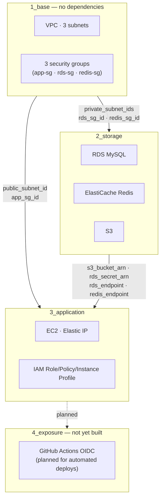

# 42VoiceBridge AWS Infra — Guide

This is the AWS infrastructure for the 42VoiceBridge backend: EC2 (app) + RDS
MySQL + ElastiCache Redis + S3 (recordings/TTS audio). The AI server and Naver
CLOVA Voice are external services, outside the scope of this infrastructure.

> The full list of environment variables the application needs, and where each
> value comes from, lives in
> [42VoiceBridge_BE's `docs/DEPLOYMENT.md`](https://github.com/42VoiceBridge/42VoiceBridge_BE/blob/develop/docs/DEPLOYMENT.md).

## ⚠️ Read this first: cost warning

This setup costs **roughly $0.61/hour, about $445/month, if run 24/7 in the
Seoul region** (based on EC2 m5.large + RDS db.r5.large + ElastiCache
cache.m5.large).

**The AWS account this runs on has a $100 budget. Never leave it running
continuously.**

> **Always run `terraform destroy` once you're done testing.**
> Leaving `apply`'d resources up for even a few days can blow past the budget.

## 📂 Layered structure

Instead of one flat set of files, resources are split into 3 layers. The
dependency direction always flows **1_base → 2_storage → 3_application**, one
way only.



```
environments/dev/
├── 1_base/          # VPC, subnets, IGW, route tables, all 3 security groups (app/rds/redis)
├── 2_storage/       # RDS MySQL, ElastiCache Redis, S3
└── 3_application/   # EC2, Elastic IP, IAM Role/Policy/Instance Profile
```

Each layer keeps its own local `terraform.tfstate`. A higher layer reads a
lower layer's state through `data "terraform_remote_state"`
(`backend = "local"`, `path = "../N_layer/terraform.tfstate"`).

- **1_base**: no dependencies (top-level layer). All 3 security groups
  (app-sg, rds-sg, redis-sg) live here because rds-sg/redis-sg need to
  reference app-sg as their ingress source — splitting them across layers
  would create a circular dependency.
- **2_storage**: reads 1_base's outputs (private subnet IDs, rds-sg/redis-sg
  IDs).
- **3_application**: reads 1_base's outputs (public subnet ID, app-sg ID) and
  2_storage's outputs (S3 bucket ARN, RDS/Redis endpoints, Secrets Manager
  ARN).
- **4_exposure**: doesn't exist yet. Reserved for wiring up GitHub Actions
  CI/CD for automated deploys later.

Each layer only exports outputs for resources it actually creates with
`resource` (e.g. 3_application only created EC2/EIP, so it only outputs
`ec2_public_ip` — RDS/Redis endpoints must be read from 2_storage, the layer
that actually created them). Because of this, if you want every connection
value in one place, follow the "Checking connection info" section below and
query `terraform output` per layer.

## Prerequisites

1. In the AWS Console → EC2 → Key Pairs, create a new key pair and keep the
   `.pem` file somewhere safe. You'll use this key pair name for
   `3_application`'s `ssh_key_name` variable.
2. In each layer directory, copy `terraform.tfvars.example` to
   `terraform.tfvars` and fill in real values (gitignored, never committed).

   ```bash
   cp terraform.tfvars.example terraform.tfvars
   ```

   - `1_base`'s `ssh_allowed_cidr`: restrict to your own IP (e.g.
     `1.2.3.4/32`). **Never `0.0.0.0/0`.**
   - `3_application`'s `ssh_key_name`: the key pair name from step 1.

3. Make sure AWS credentials are configured (`aws configure` or environment
   variables).

## Deploy order (follow this exactly)

Deploy layers bottom-up. Since higher layers read lower layers' state files,
skipping the order will break `terraform_remote_state` lookups.

```bash
cd environments/dev/1_base
terraform init
terraform plan
terraform apply

cd ../2_storage
terraform init
terraform plan
terraform apply

cd ../3_application
terraform init
terraform plan
terraform apply
```

## When you're done testing — destroy in reverse order

**Destroying a lower layer first breaks the higher layers that reference it**
(subnets, security groups, the S3 bucket, etc. disappear out from under them,
and destroy/apply fails with an error). Always go
`3_application → 2_storage → 1_base`.

```bash
cd environments/dev/3_application && terraform destroy

cd ../2_storage && terraform destroy

cd ../1_base && terraform destroy
```

**Don't forget this.** See the cost warning above — leaving `apply`'d
resources up for even a few days can blow past the $100 budget.

## Checking connection info

Each layer only shows the outputs for what it actually built.

| What you want | Where to look |
|---|---|
| EC2 public IP | `cd environments/dev/3_application && terraform output ec2_public_ip` |
| RDS endpoint / Secrets Manager ARN | `cd environments/dev/2_storage && terraform output rds_endpoint` / `terraform output rds_secret_arn` |
| Redis endpoint / port | `cd environments/dev/2_storage && terraform output redis_endpoint` / `terraform output redis_port` |
| S3 bucket name | `cd environments/dev/2_storage && terraform output s3_bucket_name` |

## Looking up the RDS password

The RDS master password never lives in code — AWS Secrets Manager manages it
automatically (`manage_master_user_password = true`). The EC2 IAM role is
also granted the minimum `secretsmanager:GetSecretValue` permission needed to
read that one secret (`environments/dev/3_application/iam.tf`).

**CLI (locally or from inside the EC2 instance):**

```bash
cd environments/dev/2_storage
SECRET_ARN=$(terraform output -raw rds_secret_arn)
aws secretsmanager get-secret-value --secret-id "$SECRET_ARN" \
  --query 'SecretString' --output text | jq .
```

**Console:** AWS Console → Secrets Manager → select the secret linked to the
RDS instance → "Retrieve secret value".

## Writing `.env` after connecting to EC2

```bash
cd environments/dev/3_application
ssh -i /path/to/key.pem ec2-user@$(terraform output -raw ec2_public_ip)
```

After connecting, fill in the application's `.env` like this. Look up each
value using the commands in "Checking connection info" above.

```env
DB_HOST=<2_storage's rds_endpoint>
DB_PORT=3306
DB_NAME=voicebridge
DB_USERNAME=voicebridge_admin
DB_PASSWORD=<the "password" field from the Secrets Manager lookup above>

REDIS_HOST=<2_storage's redis_endpoint>
REDIS_PORT=<2_storage's redis_port>

S3_BUCKET=<2_storage's s3_bucket_name>
AWS_REGION=ap-northeast-2
```

The application uses `DefaultCredentialsProvider`, so you never need to put
an access key in `.env` — the IAM Instance Profile attached to EC2 already
provides S3 access and Secrets Manager read permission.
