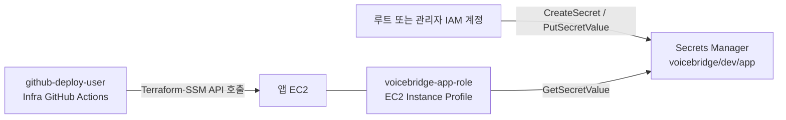

# Secrets Manager와 EC2 IAM 역할

2026-10-03 기준 프로젝트의 Terraform 코드와 AWS 문서를 바탕으로 작성했다. **앱 시크릿 생성과 EC2의 실제 읽기 성공은 아직 확인되지 않았다.** 예시 값은 실제 키가 아니다.

## 무엇을 저장하는가

AWS Secrets Manager는 API 키·암호·토큰 같은 비밀값을 암호화해 저장하고, 권한이 있는 주체에게 API로 제공하는 서비스다. 이 프로젝트에서는 두 종류의 시크릿을 사용한다.

| 시크릿 | 생성·관리 방법 | 사용하는 값 |
|---|---|---|
| 앱 시크릿 `voicebridge/dev/app` | 운영자가 같은 AWS 계정의 서울 리전에 수동 생성·수정 | JWT 비밀값, AI 서버 URL, NCP TTS 키, 필요하면 GHCR 읽기 자격증명 |
| RDS 관리형 시크릿 | Terraform `2_storage`의 RDS 설정에 따라 RDS가 생성·관리 | DB 사용자 이름과 비밀번호 |

시크릿은 **생성한 IAM 사용자의 개인 보관함이 아니다.** AWS 계정과 리전에 존재하는 자원이다. ARN에도 리전과 AWS 계정 ID가 포함된다. 루트로 만들든 관리자 IAM 사용자로 만들든, 이후 접근 여부는 요청하는 주체의 IAM 권한과 적용된 자원 정책·암호화 키 정책에 따라 결정된다. [AWS: Secrets Manager 접근 제어](https://docs.aws.amazon.com/secretsmanager/latest/userguide/auth-and-access.html)

## 누가 만들고 누가 읽는가

현재 별도 관리자 IAM 계정이 없으므로 **이번 앱 시크릿은 루트 계정으로 콘솔에서 생성할 수 있다.** 그 작업이 EC2에 루트 권한을 주지는 않는다. `github-deploy-user`의 권한도 EC2로 전달되지 않는다. Terraform의 [EC2 설정](../../infra/environments/dev/3_application/ec2.tf)은 `voicebridge-app-role`이 들어 있는 Instance Profile을 EC2에 연결하고, [IAM 설정](../../infra/environments/dev/3_application/iam.tf)은 그 역할에 앱 시크릿과 RDS 시크릿의 `secretsmanager:GetSecretValue`를 허용한다. EC2는 역할의 임시 자격증명으로 AWS API를 호출한다. [AWS: EC2 IAM 역할](https://docs.aws.amazon.com/AWSEC2/latest/UserGuide/iam-roles-for-amazon-ec2.html), [AWS: 시크릿 읽기 정책](https://docs.aws.amazon.com/secretsmanager/latest/userguide/auth-and-access_iam-policies.html)

`github-deploy-user`는 GitHub Actions에서 Terraform과 SSM 명령을 실행하는 주체다. 현재 이 사용자에게 기록된 `IAMFullAccess`는 **Secrets Manager 시크릿 생성 권한을 뜻하지 않는다.** 이 배포 스크립트는 시크릿 값을 GitHub Actions로 가져오지 않고 EC2 안에서 읽는다. 루트 액세스 키를 GitHub에 등록할 필요도 없다.

AWS는 루트를 일상 작업에 사용하지 않도록 권장한다. 지금은 루트 콘솔에서 생성할 수 있지만, 이후 관리자용 로그인 계정을 마련하고 루트에는 MFA를 적용해 사용을 줄인다. 루트 액세스 키는 만들지 않는다. [AWS: 루트 사용자 권장 사항](https://docs.aws.amazon.com/IAM/latest/UserGuide/root-user-best-practices.html)

## 앱 시크릿을 콘솔에 등록하는 순서

1. 루트로 AWS 콘솔에 로그인하고, 우측 상단 리전을 **Asia Pacific (Seoul), `ap-northeast-2`**로 확인한다.
2. **Secrets Manager → Store a new secret(새 보안 암호 저장)**을 선택한다.
3. **Other type of secret(기타 유형의 보안 암호)**을 선택하고 Key/value pairs에 아래 필드를 입력한다. 필드 이름의 대소문자를 그대로 사용한다.

   | 필드 | 값의 출처 |
   |---|---|
   | `JWT_SECRET` | 운영자가 만든 충분히 긴 임의의 문자열 |
   | `AI_SERVER_BASE_URL` | AI 서버 배포 후 실제 접근 주소. AI를 제외한 초기 BE 배포에서는 생략 가능 |
   | `NCP_TTS_API_KEY_ID` | AI·NAVER API의 CLOVA Voice Application **Client ID** |
   | `NCP_TTS_API_KEY` | 같은 Application의 **Client Secret** |

   AWS Secrets Manager의 **Key** 칸에는 위 환경변수 이름을 그대로, **Value** 칸에는 각각의 실제 값을 입력한다. NCP 계정의 **API Authentication Key(Access Key ID / Secret Key)**는 이 두 필드에 넣는 CLOVA Voice 인증 정보가 아니다. CLOVA Voice는 NCP 콘솔의 **AI·NAVER API → Application**에서 발급한 Client ID / Client Secret을 요구한다. [NCP: CLOVA Voice 이용 신청·인증 정보](https://guide.ncloud-docs.com/docs/clovavoice-start), [NCP: 요청 헤더](https://api.ncloud-docs.com/docs/ai-naver-clovavoice)

   GHCR 이미지가 비공개라면 `GHCR_USERNAME`, `GHCR_READ_TOKEN`도 **함께** 입력한다. 공개 이미지라면 생략한다. 입력값을 스크린샷, 문서, Terraform 변수나 GitHub Secrets에 복사하지 않는다.
4. 암호화 키는 일반적인 동일 계정 사용에 맞춰 기본 **`aws/secretsmanager`**를 선택한다. 별도 고객 관리 KMS 키를 선택하면 EC2 역할에 그 키의 `kms:Decrypt` 권한도 필요하다. [AWS: 시크릿 생성과 암호화 키](https://docs.aws.amazon.com/secretsmanager/latest/userguide/create_secret.html)
5. 시크릿 이름을 정확히 **`voicebridge/dev/app`**으로 지정한다. 설명은 선택 사항이다. 자동 교체와 타 리전 복제는 현재 앱 시크릿 배포 경로에 구성돼 있지 않으므로 처음 생성할 때 켤 필요가 없다. 검토 화면에서 이름·리전·필드를 확인한 뒤 저장한다.
6. 목록에 이름이 나타나는지 확인한다. **Retrieve secret value**를 누르면 실제 값이 화면에 표시되므로 화면 공유나 캡처 중에는 누르지 않는다. [AWS: 콘솔에서 값 확인](https://docs.aws.amazon.com/secretsmanager/latest/userguide/retrieving-secrets-console.html)

시크릿을 만들었다고 곧바로 앱이 배포되는 것은 아니다. Terraform `1_base → 2_storage → 3_application`을 적용해 EC2 역할과 권한을 생성한 뒤, [SSM 수동 배포 절차](../SSM-DEPLOYMENT.md)의 `check`와 `deploy`를 실행한다. 기존 AWS 자원 적용 여부와 다음 작업은 [배포 진행표](../../deploy-step.md)에서 추적한다.

## 카카오 로그인 키는 지금 어디에 두는가

현재 BE는 `/api/v1/auth/kakao` 요청으로 **사용자별 카카오 액세스 토큰**을 받고, 그 토큰을 `Authorization: Bearer` 헤더로 카카오 사용자 정보 API에 전달한다. BE에는 카카오 앱 키·REST API 키·Client secret을 읽는 환경변수나 배포 설정이 없다. 따라서 **현재 앱 시크릿 `voicebridge/dev/app`에 카카오 키를 추가할 필요가 없고, BE GitHub Secrets에도 넣지 않는다.** 값을 추가하더라도 현재 앱은 읽지 않는다. [BE의 카카오 사용자 정보 어댑터](https://github.com/42VoiceBridge/42VoiceBridge_BE/blob/develop/src/main/java/com/voicebridge/adapter/out/auth/KakaoUserInfoAdapter.java), [카카오 사용자 정보 API](https://developers.kakao.com/docs/en/kakaologin/rest-api)

카카오 개발자 콘솔에 보이는 키의 종류와 실제 로그인 구현 주체는 별도로 확인한다.

| 항목 | 현재 또는 향후 저장 위치 |
|---|---|
| 로그인 사용자의 액세스 토큰 | 로그인 요청마다 클라이언트가 BE에 전달하는 단기 토큰. 고정 배포 시크릿으로 저장하지 않음 |
| 웹·모바일 앱의 플랫폼 키 | 해당 클라이언트 앱 설정에서 관리. 현재 BE 배포 시크릿에 넣지 않음 |
| 카카오 REST API `client_secret` | 향후 **BE가 인가 코드로 토큰을 직접 발급·갱신하는 방식**을 구현한다면 서버 측 비밀값으로 보관. 그때 AWS Secrets Manager와 BE 환경변수·배포 스크립트를 함께 변경 |

카카오의 REST API 토큰 발급에서는 설정에 따라 `client_secret`이 필요하다. 지금 BE는 그 토큰 발급 API를 호출하지 않는다. [카카오 로그인 REST API 문서](https://developers.kakao.com/docs/en/kakaologin/rest-api)
